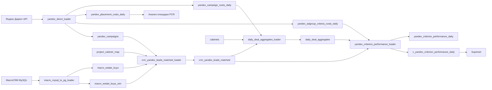

### Пайплайн по аналитике маркейтинг Практика

Сквозная аналитика для связки **Яндекс Директ → MacroCRM → PostgreSQL → Superset**.

Репозиторий содержит пять Airflow DAG-ов и документацию по их настройке, порядку запуска, таблицам, метрикам и диагностике.

## Назначение

Пайплайн решает четыре задачи:

1. Загружает показы, клики и расходы из Яндекс Директа.
2. Загружает заявки, статусы, сделки и UTM-историю из MacroCRM.
3. Связывает CRM-лиды с рекламными кампаниями по `cid`, `gid`, `phid` и справочнику ЖК.
4. Строит кампанийную и детальную витрины для Superset без размножения расходов и лидов между уровнями детализации.

## Архитектура



Главный архитектурный принцип: **не смешивать в одной таблице разные зерна данных**. Кампанийные расходы, площадки и детализация до группы/условия показа хранятся отдельно.

## DAG-и

| DAG ID | Файл | Назначение | Cron в коде |
|---|---|---|---|
| `yandex_direct_loader` | `dags/yandex_direct_loader.py` | Три отчета Яндекс Директа и справочник кампаний | `0 21 * * *` |
| `macro_mysql_to_pg_loader` | `dags/macro_mysql_to_pg_loader.py` | Заявки и UTM из MacroCRM MySQL в PostgreSQL | `45 21 * * *` |
| `crm_yandex_leads_matched_loader` | `dags/crm_yandex_leads_matched_loader.py` | Аудитный матчинг CRM ↔ Яндекс | `15 1 * * *` |
| `daily_deal_aggregates_loader` | `dags/daily_deal_aggregates_loader.py` | Витрина на уровне кампании | `20 22 * * *` |
| `yandex_criterion_performance_loader` | `dags/yandex_criterion_performance_loader.py` | Витрина до группы и `criterion` | `40 22 * * *` |


Требуемая последовательность:

```text
yandex_direct_loader
→ macro_mysql_to_pg_loader
→ crm_yandex_leads_matched_loader
→ daily_deal_aggregates_loader
→ yandex_criterion_performance_loader
```

## Основные таблицы

| Объект | Зерно | Роль |
|---|---|---|
| `yandex_campaign_costs_daily` | `date + cabinet_id + campaign_id` | Основные показы, клики и расходы |
| `yandex_placement_costs_daily` | `date + cabinet_id + campaign_id + placement` | Чистка площадок РСЯ |
| `yandex_adgroup_criteria_costs_daily` | `date + cabinet_id + campaign_id + ad_group_id + criterion_id + device` | Детализация рекламы |
| `macro_estate_buys` | `estate_buy_id` | CRM-заявки, статусы и сделки |
| `macro_estate_buys_utm` | `id` | UTM-история заявок |
| `crm_yandex_leads_matched` | один Яндекс-кандидат CRM-лида | Аудит матчинга CRM ↔ Яндекс |
| `daily_deal_aggregates` | `date + cabinet_id + campaign_id` | Контрольная кампанийная витрина |
| `yandex_criterion_performance_daily` | дата + кабинет + кампания + группа + criterion + служебный тип строки | Детальная витрина |
| `v_yandex_criterion_performance_daily` | как у детальной витрины | Представление для Superset |

## Быстрый запуск

### 1. Разместить DAG-и

Скопировать содержимое `dags/` в каталог DAG-ов Airflow.

### 2. Настроить Airflow Connections

| Connection ID | Назначение |
|---|---|
| `postgres_default` | Целевая PostgreSQL |
| `mysql_macrodata` | MySQL базы MacroCRM |

### 3. Создать внешние объекты PostgreSQL

Следующие объекты используются DAG-ами, но их DDL в исходном комплекте отсутствует:

```text
macro_estate_buys
macro_estate_buys_utm
yandex_campaigns
cabinets
project_cabinet_map
```

Минимальные требования к колонкам и ключам приведены в [`docs/02-configuration.md`](docs/02-configuration.md).

### 4. Настроить Airflow Variables

Обязательная переменная:

```text
yandex_direct_accounts
```

Пример значения находится в [`examples/yandex_direct_accounts.example.json`](examples/yandex_direct_accounts.example.json).

Дополнительные переменные:

```text
macro_v2_full_load
macro_mysql_full_reload_from
macro_v2_target_date
yandex_direct_target_date
```

### 5. Проверить timezone

`macro_mysql_to_pg_loader` при отсутствии ручной даты использует `Asia/Yekaterinburg`. Остальные cron-расписания используют timezone Airflow/DAG, явно не заданную в коде. До первого запуска необходимо зафиксировать единый timezone и проверить смысл `data_interval_end`.

### 6. Выполнить первичную загрузку

```text
1. Установить macro_v2_full_load = true.
2. Задать согласованную target_date для Яндекса и MacroCRM.
3. Запустить пять DAG-ов строго в требуемом порядке.
4. Выполнить контрольные SQL-проверки.
5. Вернуть macro_v2_full_load = false.
```

Подробный runbook: [`docs/05-operations.md`](docs/05-operations.md).

## Ключевые правила расчета

- `Cost` из API Яндекс Директа делится на `1_000_000` и хранится без НДС.
- В view поле `cost_with_vat` рассчитывается как `cost * 1.22` — это именно текущая формула кода.
- Целевой лид: статус `Подбор`, `Бронь`, `Сделка в работе`, `Сделка проведена` или `Сделка совершена`.
- Статус `Удалено` сохраняется в аудитной таблице, но исключается из итоговых витрин.
- Поле `lead` в `daily_deal_aggregates` означает **количество целевых лидов**, а не все лиды.
- `daily_deal_aggregates.total_deals` и детальная метрика `deals` используют разные определения; это отдельно зафиксировано в документации.
- `yandex_placement_costs_daily` не следует соединять с CRM для расчета CPL: уровень `placement` размножит кампанийные лиды.
- В детальной витрине `device` агрегируется, потому что CRM-лид обычно не содержит устройство.

## Документация

- [`docs/01-architecture.md`](docs/01-architecture.md) — поток данных, зависимости и алгоритм матчинга.
- [`docs/02-configuration.md`](docs/02-configuration.md) — Connections, Variables, внешние таблицы и безопасность.
- [`docs/03-dag-reference.md`](docs/03-dag-reference.md) — подробное описание каждого DAG-а.
- [`docs/04-data-model.md`](docs/04-data-model.md) — таблицы, зерно, поля и определения метрик.
- [`docs/05-operations.md`](docs/05-operations.md) — расписание, запуск, backfill и проверки качества.
- [`docs/06-troubleshooting.md`](docs/06-troubleshooting.md) — диагностика типовых проблем.
- [`docs/07-known-limitations.md`](docs/07-known-limitations.md) — технические риски и расхождения текущей реализации.
- [`docs/08-it-handoff-checklist.md`](docs/08-it-handoff-checklist.md) — чек-лист передачи в IT.
- [`docs/09-source-manifest.md`](docs/09-source-manifest.md) — соответствие исходных и нормализованных имен файлов.

## Безопасность

В Git нельзя коммитить:

```text
Токены директа 
пароли и строки подключения к БД
реальные Airflow Variables
дампы с nda данными
логи с токенами 
```
